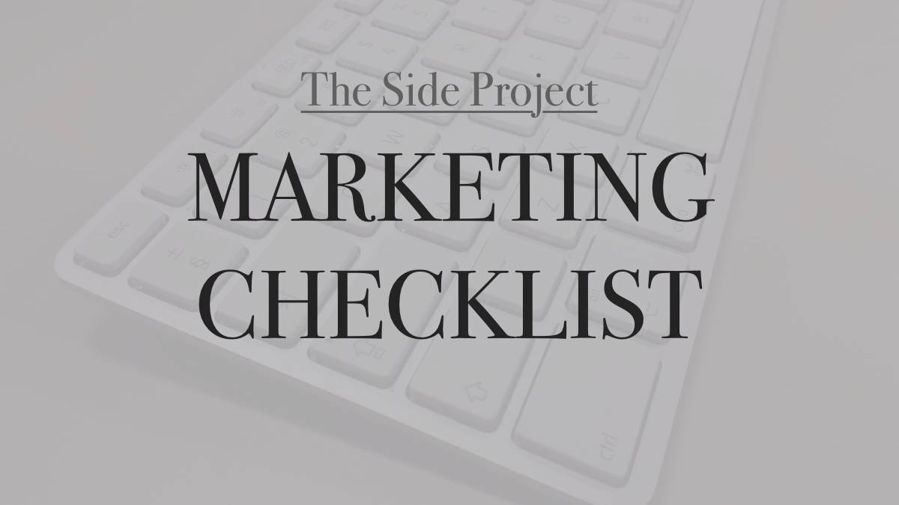

# Side Project Marketing

[A checklist of tactics for marketing your side projects](marketing-checklist.md). 

## Why?

I've been building little software side projects for years, but I've always been terrible at marketing them. I come up with some ideas, forget those ideas, do some random stuff, then lose interest. The goal of this repository is to fix that.

In this repo, I keep a list of the side project marketing tactics and ideas I've picked up from reading sites like [Indie Hackers](https://www.indiehackers.com/), [Hacker News](https://news.ycombinator.com/), and [Reddit](https://www.reddit.com/) as well as random books and blog posts. For each of my side projects, I fork this repository and keep a list of what I have done and still need to do. This keeps my marketing efforts more focused, and if anyone else finds it useful, they can make their own fork with their own ideas.

## How to use

1. Copy the [marketing-checklist.md](marketing-checklist.md) file or [fork this repository](https://github.com/karllhughes/side-project-marketing).

2. Add, remove, or modify the tactics as you see fit based on your project and customers.

3. Get to work! The checklist format allows you to keep up with which things you've tried and which you haven't.

4. Profit? I mean, that's the goal, right?

## Organization

This list is meant to be **as comprehensive as possible**. Your job is to **narrow down what works and what doesn't** for your project. This list also does not attempt to teach you *how* to do most of these things - that's something you'll have to research on your own - but the list stays focused on simple descriptions of tasks you can do to market your side project or startup.

Finally, **the list is ordered in chronological order**. Things you will do before your product launch are typically at the top of the list and things you will do later show up at the bottom.

If you have ideas that I _haven't_ included or you think you could improve the list, please see the [Contributing](#contributing) section below. I'm not a marketing professional so I welcome any and all feedback!

## Index

- [Pre-Launch](marketing-checklist.md#pre-launch)
  - [Market Research](marketing-checklist.md#market-research)
    - [Competitive Landscape](marketing-checklist.md#competitive-landscape)
    - [Customer Research](marketing-checklist.md#customer-research)
  - [PR Preparations](marketing-checklist.md#pr-preparations)
  - [Landing Page](marketing-checklist.md#landing-page)
  - [Blog Setup](marketing-checklist.md#blog-setup)
  - [Social Media Setup](marketing-checklist.md#social-media-setup)
- [Post-Launch](marketing-checklist.md#post-launch)
  - [Customer Outreach](marketing-checklist.md#customer-outreach)
  - [Free Promotional Channels](marketing-checklist.md#free-promotional-channels)
  - [Paid Promotional Channels](marketing-checklist.md#paid-promotional-channels)
- [Recurring](marketing-checklist.md#recurring)
  - [Blogging](marketing-checklist.md#blogging)
  - [Email](marketing-checklist.md#email)
  - [Social Media](marketing-checklist.md#social-media)
  - [Public Relations](marketing-checklist.md#public-relations)
  - [External Sites](marketing-checklist.md#external-sites)
- [Optimize](marketing-checklist.md#optimize)

## Contributing

As with any open source project, I welcome contributors. Submit an [issue](https://github.com/karllhughes/side-project-marketing/issues) or [pull request](https://github.com/karllhughes/side-project-marketing/pulls) with your improvements or suggestions. All contributors will be fully credited.

### Contributors

Submit a PR to get your name and link listed here.

- [Karl L. Hughes](https://www.karllhughes.com/)

## Credits

Below are just a few of the blog posts and resources I've found helpful in compiling this list. I'm no marketer, so be sure to check these people out:

- [ProBlogger's 31 Days to Build a Better Blog](https://problogger.com/31dbbb-workbook/)
- [Matt McCaffrey's List of Places to Post Your Startup](https://github.com/mmccaff/PlacesToPostYourStartup/blob/master/README.md)
- [Tomáš Ondrejka's "Ultimate Startup Marketing Checklist"](https://blog.markgrowth.com/the-ultimate-startup-marketing-checklist-31666bd56e41)
- ["The Startup Marketing Checklist" by Elie Mourad](https://medium.com/@Elie_1582/the-startup-marketing-checklist-fb6ac43fc5cb)
- [The Online Marketing Checklist by Visibly Better Marketing](https://trello.com/b/2WfXtByI/the-online-marketing-checklist)
- [An Epic List of 100 Growth Hacks for Startups by Justin McGill](https://www.searchenginejournal.com/epic-list-100-growth-hacks-startups/118690/)

## License

This documentation is offered under the MIT License:

> MIT License
> 
> Copyright (c) 2017 Karl L. Hughes
> 
> Permission is hereby granted, free of charge, to any person obtaining a copy
of this software and associated documentation files (the "Software"), to deal
in the Software without restriction, including without limitation the rights
to use, copy, modify, merge, publish, distribute, sublicense, and/or sell
copies of the Software, and to permit persons to whom the Software is
furnished to do so, subject to the following conditions:
> 
> The above copyright notice and this permission notice shall be included in all
copies or substantial portions of the Software.
> 
> THE SOFTWARE IS PROVIDED "AS IS", WITHOUT WARRANTY OF ANY KIND, EXPRESS OR
IMPLIED, INCLUDING BUT NOT LIMITED TO THE WARRANTIES OF MERCHANTABILITY,
FITNESS FOR A PARTICULAR PURPOSE AND NONINFRINGEMENT. IN NO EVENT SHALL THE
AUTHORS OR COPYRIGHT HOLDERS BE LIABLE FOR ANY CLAIM, DAMAGES OR OTHER
LIABILITY, WHETHER IN AN ACTION OF CONTRACT, TORT OR OTHERWISE, ARISING FROM,
OUT OF OR IN CONNECTION WITH THE SOFTWARE OR THE USE OR OTHER DEALINGS IN THE
SOFTWARE.
